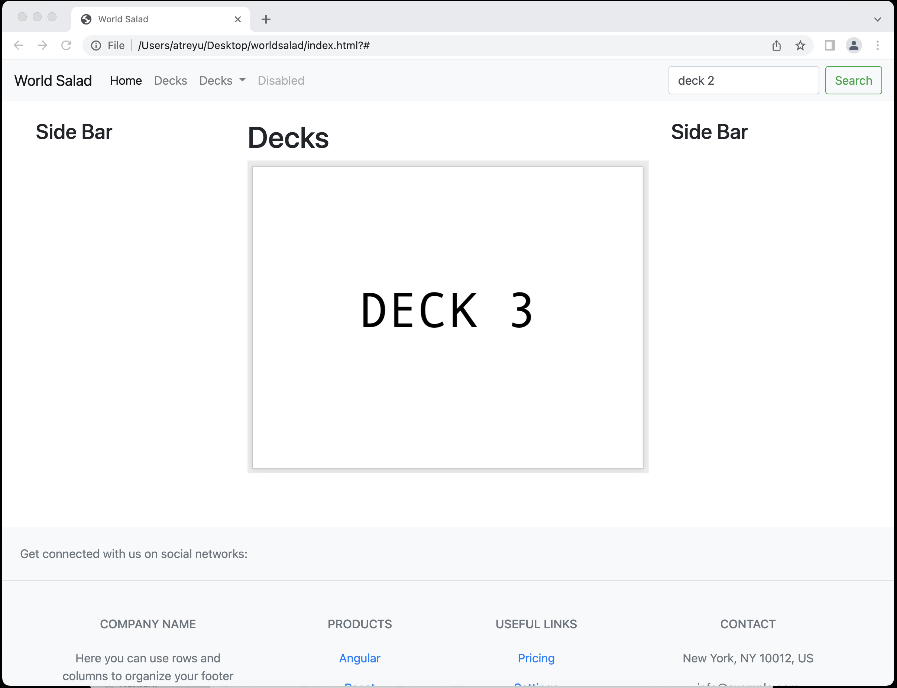

### Page 1: Home Page ###
* Page Description (include a mockup or hand drawn image of the page)
    * Header with Links
    * Single Column
    * Description of Service
    * Big Green Link to Deck Viewing Pages
    * Footer with Contact

        

* Parameters needed for the page

    * MVP idea and scope
    * Logo
    * Description excerpt

* Data needed to render the page

    * Home Page HTML

* Link destinations for the page

    * Links to deck viewing, contact page
    * Quick links to individual decks

* List of tests for verifying the rendering of the page

    * Page can be accessed via `/` and `/index.html`
    * Correct page title
    * Correct page contents
    * Appropriate flashcard deck loaded when corresponding deck image clicked
    * All links lead to correct pages
    * Drop down menus display when menu item clicked

=======================================================================

### Page 2: Viewing Page for all Decks ###
* Page Description (include a mockup or hand drawn image of the page)
* Parameters needed for the page
* Data needed to render the page
* Link destinations for the page

* List of tests for verifying the rendering of the page
    * Page can be accessed via `/decks/` and `/decks`
    * Correct page title
    * All available decks displayed
    * All links lead to correct pages
    * Drop down menus display when menu item clicked

=======================================================================

### Page 3: Individual Deck Page ###
* Page Description (include a mockup or hand drawn image of the page)
* Parameters needed for the page
* Data needed to render the page
* Link destinations for the page

* List of tests for verifying the rendering of the page
    * Page can be accessed via `/decks/<deck_name>/` and `/decks/<deck_name>`
    * Correct page title
    * All links lead to correct pages
    * Drop down menus display when menu item clicked
    * Appropriate flashcard deck loaded
    * Clicking flashcard displays back of card
    * Front of flashcard corresponds to correct back of card (i.e., word matches definition)

=======================================================================

### Page 4: Login Page ###
* Page Description (include a mockup or hand drawn image of the page)
* Parameters needed for the page
* Data needed to render the page
* Link destinations for the page

* List of tests for verifying the rendering of the page
    * Page can be accessed via `/login/` and `/login`
    * Correct page title
    * Correct page contents
    * All links lead to correct pages
    * Drop down menus display when menu item clicked
    * Correct username and password results in authentication
    * Error displayed for incorrect username/password

=======================================================================

### Page 5: Contact Page ###
* Page Description (include a mockup or hand drawn image of the page)
* Parameters needed for the page
* Data needed to render the page
* Link destinations for the page

* List of tests for verifying the rendering of the page
    * Page can be accessed via `/contact/` and `/contact`
    * Correct page title
    * All links lead to correct pages
    * Drop down menus display when clicked
    * Contact form displayed
    * Form can be submitted with valid name, email address, message entered
    * Error message displayed when invalid information entered
 
